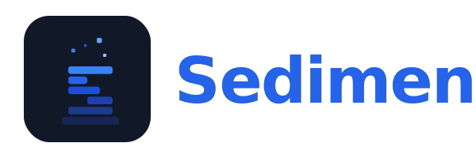

<div align="center">



<br/>

**Tacit knowledge extraction system for AI Agents**

*Turns messy materials into a white-box knowledge base that humans and agents can inspect together.*

<br/>

[](LICENSE)
[](https://www.python.org/)
[](https://modelcontextprotocol.io/)
[](https://github.com/astral-sh/uv)

</div>

---

[🇺🇸 English](README.md) | [🇨🇳 中文](README_zh.md)

---

Sediment is a white-box tacit-knowledge system for AI agents. It focuses on a
reliable runtime for inspecting, validating, and retrieving a Markdown
knowledge base. Ingest and tidy are shipped as experimental workflow skills,
not as fully productized runtime automation.

Sediment v4 is built around a few non-negotiable ideas:
- **White-box first**: the knowledge base is just files, not a hidden database
- **Provenance is metadata**: sources stay traceable, but source names are not graph nodes
- **Moderate structure beats fragile freedom**: entries have enough shape for reliable tidy/health checks without becoming heavyweight forms
- **Human review stays easy**: the same files work for agents, scripts, and editors such as Obsidian

See [design/tacit_knowledge_system_v4_5.md](design/tacit_knowledge_system_v4_5.md) for the current design. `v4` and `v3` are retained as historical context.

## v4 Entry Model

Sediment formal entries come in two types plus a lightweight placeholder form.

### Concept entry

```markdown
---
type: concept
status: fact
aliases: []
sources:
  - source document name
---
# Heat Backup

Heat backup is the ready-to-take-over backup path used when the primary path cannot be trusted.

## Scope
Use it for systems that require continuity during failover, especially when switching paths must be controlled.

## Related
- [[Failover]] - heat backup is a prerequisite for controlled failover
```

### Lesson entry

```markdown
---
type: lesson
status: inferred
aliases: []
sources:
  - incident review name
---
# Confirm heat backup before draining traffic

Confirm heat backup before draining traffic, or the protective action can create a larger recovery problem.

## Trigger
Use this when traffic is being actively shifted, drained, or throttled during risk mitigation.

## Why
Traffic movement changes the system shape immediately, so backup readiness must be verified before the move.

## Risks
If ignored, the system may survive the original issue but fail during the mitigation path.

## Related
- [[Heat Backup]] - prerequisite capability
```

### Placeholder entry

```markdown
---
type: placeholder
aliases: []
---
# Dark Flow

This concept is referenced in the knowledge base but is not yet defined well enough to promote.
```

## Install

```bash
git clone https://github.com/huyusong10/Sediment.git
cd Sediment
uv sync --dev
```

Built-in runtime code and skill resources live under:

```text
mcp_server/
skills/
  ingest/
  tidy/
  explore/
  health/
```

## Run The MCP Server

```bash
export SEDIMENT_KB_PATH=/path/to/your/knowledge-base
export SEDIMENT_CLI=claude
uv run sediment-server
```

Environment variables:

| Variable | Default | Description |
|---|---|---|
| `SEDIMENT_KB_PATH` | project `knowledge-base/` | Path to the KB root |
| `SEDIMENT_CLI` | `claude` | CLI command used by `knowledge_ask` and experimental workflow harnesses |
| `SEDIMENT_HOST` | `0.0.0.0` | HTTP bind address |
| `SEDIMENT_PORT` | `8000` | HTTP port |
| `SEDIMENT_SSE_PATH` | `/sediment/` | SSE endpoint path |

## Use The KB

- **Explore**: ask natural-language questions through `knowledge_ask`, or use `knowledge_list` + `knowledge_read`
- **Health**: run `uv run python skills/health/scripts/health_check.py knowledge-base`
- **Ingest (experimental)**: load `skills/ingest/SKILL.md` as a workflow instruction and feed source materials
- **Tidy (experimental)**: load `skills/tidy/SKILL.md` as a workflow instruction to repair graph gaps, invalid entries, and promotable placeholders

Benchmark scripts under `testcase/` are internal evaluation harnesses, not part
of Sediment's public runtime surface.

`knowledge_ask` keeps the same public interface:

```json
{
  "answer": "...",
  "sources": ["entry-name-1", "entry-name-2"],
  "confidence": "high",
  "exploration_summary": {
    "entries_scanned": 12,
    "entries_read": 4,
    "links_followed": 3,
    "mode": "definition-driven"
  },
  "gaps": [],
  "contradictions": []
}
```

## Development

```bash
uv sync --dev
uv run ruff check .
uv run pytest
uv build
```

When editing the runtime:
- keep sources in frontmatter `sources`, never as `[[wikilinks]]`
- do not let provenance create graph edges
- keep MCP tool names and `knowledge_ask` response schema stable

## License

[MIT](LICENSE)
