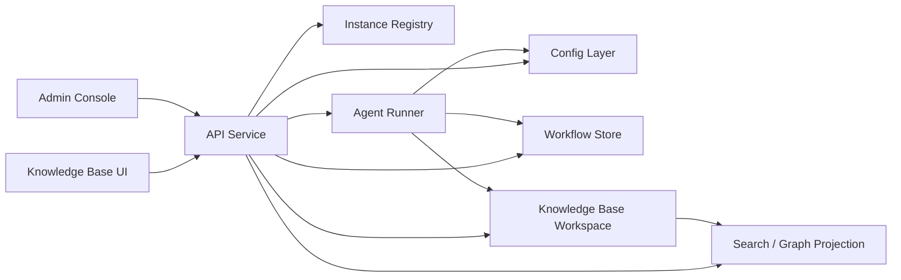

# 当前设计：平台架构

企业版 Sediment 不应只被理解为一个 MCP Server。

它应被实现为“白盒知识层 + 工作流平台层”的组合系统：

- 知识层负责保存 canonical knowledge state
- 平台层负责提交、审核、任务调度、Agent 托管执行、搜索投影和 Web 交互

## 1. 核心架构判断

企业部署下，必须同时坚持下面四个判断：

1. 正式知识层继续保存在文件系统与 Git 中，而不是迁移到隐藏数据库
2. 提交缓冲区、审核状态、任务队列、审计日志可以使用数据库
3. ingest / tidy 的核心推理仍由本地 Agent 执行
4. 普通用户不应被要求登录知识库主机或手工调用本地 skill

## 2. 平台分层

推荐把企业版 Sediment 拆成以下部件：

- Knowledge Base Workspace：白盒 Markdown 知识库和 Git 工作区
- API Service：统一承载 MCP 和 REST 接口
- Config Layer：统一读取实例本地 `config/sediment/config.yaml`
- Instance Registry：只保存实例名到实例根目录 / config 路径的全局映射
- Workflow Store：保存提交、审核、任务、审计和锁信息
- Agent Runner：在知识库本地执行 ingest / tidy / explore 的托管 Agent
- Search / Graph Projection：为全文搜索、图谱浏览和后台筛选提供查询投影
- Web Apps：前台知识库界面和后台管理界面
- Quartz Hosted Site：由 Sediment 服务层托管的静态 Quartz 站点



## 3. 部件职责

### 3.1 Knowledge Base Workspace

职责：

- 保存 `entries/`、`placeholders/`、`indexes/`
- 保持 Git 历史、diff 和人工可审阅性
- 作为 Agent Runner 的本地执行上下文

约束：

- 不保存提交缓冲区和审核状态
- 不保存“尚未合并”的草案真相

### 3.2 API Service

职责：

- 暴露 MCP 工具和 REST 接口
- 统一鉴权、session、限流、审计和权限检查
- 读取知识层与工作流层，组装前台和后台视图

实现建议：

- 继续复用当前 `Starlette` 基座，而不是切换到全新后端框架
- 继续使用 asset-template + page JS 的服务端渲染模式
- 在现有 `sediment/server.py` 外逐步拆出路由和服务模块

### 3.3 Workflow Store

职责：

- 保存提交缓冲区
- 保存审核状态和操作日志
- 保存任务、锁和失败重试信息
- 保存后台 session 快照（`user_id / user_name / user_role / token_fingerprint`）

推荐存储：

- 生产环境使用 `PostgreSQL`
- 本地开发可使用兼容 schema 的 `SQLite`

### 3.4 Config Layer

职责：

- 固定读取实例目录下的 `config/sediment/config.yaml`
- 统一解析相对路径，避免 Windows / Unix 下命令行引号差异
- 为 CLI、Web、MCP、worker 提供同一份运行配置

配置层还负责声明选定的 Agent CLI backend。当前支持：

- `claude-code`
- `codex`
- `opencode`

并允许 `agent.command` 以字符串或 YAML 列表形式显式指定命令前缀。

当前还负责管理多用户鉴权：

- `auth.users[]` 为主 schema
- `auth.admin_token` 仅作为兼容镜像字段保存 primary owner token
- 当旧配置里只有 `auth.admin_token` 时，加载阶段会合成默认 owner user
- 首次通过 CLI / Admin UI 做受管保存时，会把配置重写为 `auth.users[]`
- 配置规范化阶段会把额外 owner 收敛为 committer，保证实例始终只有一个 owner

### 3.5 Instance Registry

职责：

- 保存 `instance.name -> instance root / config path`
- 支持 `sediment --instance NAME ...` 的全局实例解析
- 支持实例列表、实例状态查看和失效实例清理

约束：

- 注册表不保存真正的运行配置
- 真正的配置仍然只保存在实例本地 `config/sediment/config.yaml`

### 3.6 Agent Runner

职责：

- 在知识库所在主机运行本地 Agent
- 执行 `ingest`、`tidy`、必要时也可执行受控 `explore`
- 产出草案、patch、理由、引用上下文和失败日志

当前实现建议保留独立 worker 角色，在统一 CLI 入口下由 `sediment server ...`
负责平台守护进程控制，由内部 worker 角色持续轮询任务队列并在本地工作区执行 Agent。

关键约束：

- Agent Runner 必须能访问本地知识库工作区
- 每次任务应运行在隔离工作区，避免污染主工作区
- 高风险写任务必须经过 `committer` 审核后才能落地
- worker 应持续写入 job heartbeat，并能回收心跳超时的陈旧 `running` 任务

当前实现中，Agent Runner 通过统一 CLI 适配层调度不同 backend，并由
`sediment doctor` 在上线前检查配置、可执行文件、帮助命令和最小探针调用。

### 3.7 Search / Graph Projection

职责：

- 为全文搜索提供索引
- 为图谱视图提供节点和边
- 为后台筛选提供条目状态投影

投影来源：

- 条目标题、摘要、正文、别名
- `Related` 链接
- 索引链接
- `status`、`type`、入链数量、健康状态

### 3.8 Web Apps

职责：

- 前台：浏览知识库、搜索、查看概念、提交材料和意见
- 后台：提交收件箱、知识库管理、文件管理、版本管理、健康面板和任务管理
- 两者共享基础 shell，但在导航、权限和配色上彻底独立

当前 IA：

- Public Knowledge Base UI：`/`、`/search`、`/tutorial`、`/entries/{name}`、`/submit`、`/quartz/`
- Admin Console：`/admin/overview`、`/admin/kb`（知识库管理）、`/admin/files`（文件管理）、`/admin/inbox`（提交收件箱）、`/admin/version-control`（版本管理）、`/admin/users`、`/admin/system`（设置）
- 兼容路径：`/portal`、`/portal/graph-view`、`/admin`

### 3.9 Diagnostic Logging

职责：

- 为排障、运行态回放、值班诊断和后台 Live 面板提供统一的诊断事件源
- 覆盖 launcher、server、worker、Agent Runner、平台服务层和关键 CLI 诊断入口
- 与审计日志分层：诊断日志回答“系统当时做了什么”，审计日志回答“谁批准或触发了什么”

结构与规则统一由 [diagnostic-logging.md](diagnostic-logging.md) 约束。平台架构层只锁定以下判断：

- 平台长期日志文件保存结构化 JSONL，作为唯一诊断真相源
- HTTP 请求、任务执行与 Agent 运行都必须使用同一套 `component / event / 关联字段` 契约
- 边界入口应绑定 `request_id / job_id / submission_id` 等关联上下文，用于串联跨模块诊断
- `sediment logs show/follow` 负责把原始 JSONL 渲染成可读摘要，同时兼容历史前缀日志
- `/admin/kb` Live 负责当前动作的实时轨迹，不能替代长期平台日志
- 审计日志继续保存在工作流存储中，不与诊断日志共用 schema

## 4. 技术选择

### 4.1 后端

推荐继续使用 Python 服务栈：

- `Starlette` 作为 HTTP / SSE 基座
- 拆分 MCP 路由和 REST 路由
- 把核心逻辑下沉到可复用的 service 层

原因：

- 当前服务已在 `Starlette` 上运行
- 知识解析、health、inventory、explore 逻辑都已在 Python 中
- 避免因为换框架而重写已有运行时能力

### 4.2 前端

当前继续使用 Python 服务栈内建的模板与前端脚本：

- 前台知识库界面和后台管理共享同一套 API
- Quartz 图谱不重写到主壳中，而是作为独立只读站点挂载
- 在线编辑继续使用受控 textarea + 后端校验路径
- 文件管理中的文档结构浏览优先使用 index 驱动的原生分组树与健康队列联动；当前不引入依赖 jQuery 的树形插件
- 设置页提供 raw YAML + resolved config 双视图与 owner-only 一键重启；涉及监听地址的修改可在线保存，但仍需要重启服务生效

### 4.3 Quartz 取舍

当前设计不把 Quartz 作为主产品壳。

原因：

- Quartz 擅长静态浏览，不擅长审核流、任务管理和在线编辑
- 当前产品难点在“提交流”和“治理流”，不在“静态展示”
- 前台和后台最终都需要共享认证、搜索、图谱和状态接口

可接受的后续扩展是：

- 在未来增加一个 Quartz 导出器，把 canonical knowledge state 输出为只读静态镜像

当前已经落地的 Quartz 托管策略：

- 挂载路径固定为 `/quartz/`
- 由 Sediment 服务层负责 `exact file -> path.html -> path/index.html -> 404.html` 解析
- 支持 clean URL 与 percent-encoded 中文 slug
- Quartz 页面额外放宽到其实际需要的 CSP：允许 blob worker，以及 Quartz 自带 CDN 样式/脚本资源，避免关系图谱被浏览器策略拦截
- Quartz build/status 留在后台 `/admin/system` owner-only 设置区
- 后台的文档在线编辑从 `/admin/kb` 拆分到 `/admin/files`，避免提交治理与文件修订挤在同一工作区

## 5. 工作区隔离

Agent Runner 不应直接在主工作区上修改文件。

推荐流程：

1. 为任务创建隔离工作区
2. 拉取当前 canonical state
3. 运行 ingest / tidy Agent
4. 产出 patch、diff 和草案文件
5. 审核通过后再应用到正式工作区

这能避免：

- 并发任务互相覆盖
- 失败任务污染主工作区
- 人工本地编辑与后台任务互相打架

## 5.1 Server / Worker 分离

默认部署建议：

- 用户入口统一为 `sediment`
- `sediment init`：在当前目录创建实例并注册到全局实例表
- `sediment instance ...`：列出 / 查看 / 移除实例注册
- `sediment server run|start|stop|restart|status|logs`：控制平台守护进程与生命周期
- `sediment kb ...`：调用知识库 explore / health / tidy 等能力
- `sediment user ...`：管理 owner / committer 用户与 token
- `sediment review ...`：在终端里处理待审 patch
- `sediment logs ...`：从实例侧查看 server / worker 日志
- `sediment status ...`：查看平台总览、daemon、queue 和 KB health
- `sediment doctor`：检查当前配置、知识库路径、状态目录与选定 Agent backend 是否可用
- 兼容脚本 `sediment-server`、`sediment-worker`、`sediment-up` 仅保留为低层调试别名

开发环境可临时打开 server 进程内执行开关，但生产环境应保持两者分离。

额外约束：

- `sediment init` 生成初始 owner user/token 并写入配置
- `sediment server start|run` 不再生成启动期临时 admin token
- `sediment kb tidy` 采用 KB-level `scope/reason` 语义，而不是单条目 target 语义

## 6. 锁与并发

平台层至少需要两类锁：

- 资源锁：按条目、索引或目录限制并发编辑
- 任务锁：避免对同一提交重复创建 ingest / tidy 任务

合并前还应检查：

- 目标条目的文件哈希或 Git 基线是否变化
- 审核 diff 是否仍然适用于当前知识层状态

## 7. 建议的代码组织

推荐在现有仓库内逐步形成如下结构：

```text
sediment/
  api/
    portal.py
    admin.py
    mcp_tools.py
  services/
    submissions.py
    reviews.py
    health.py
    search.py
    graph.py
    kb_writeback.py
  agent_runner/
    jobs.py
    workspace.py
    ingest_runner.py
    tidy_runner.py
  db/
    models.py
    migrations/
web/
  portal/
  admin/
```

这不是一次性重构目标，而是后续迭代的目标形态。

## 8. 安全基线

企业部署下，平台层至少需要：

- 可信反向代理下的真实 IP 记录
- 提交接口限流
- 重复提交去重
- 文件类型白名单和大小限制
- 管理台鉴权与角色控制
- Admin Web session cookie 与 Bearer token 双通道
- 受控 cookie 配置，例如 `Secure`、`HttpOnly`、`SameSite=Strict`
- 基础安全响应头，例如 `CSP`、`X-Frame-Options`、`nosniff`
- 审计日志
- 任务取消、重试与陈旧任务恢复

知识层白盒不代表写路径可以无防护。
