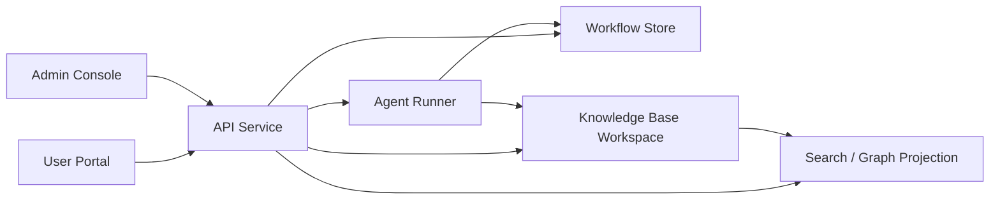

# 当前设计：平台架构

企业版 Sediment 不应只被理解为一个 MCP Server。

它应被实现为“白盒知识层 + 工作流平台层”的组合系统：

- 知识层负责保存 canonical knowledge state
- 平台层负责提交、审核、任务调度、Agent 托管执行、搜索投影和 Web 交互

## 1. 核心架构判断

企业部署下，必须同时坚持下面四个判断：

1. 正式知识层继续保存在文件系统与 Git 中，而不是迁移到隐藏数据库
2. 提交缓冲区、审核状态、任务队列、审计日志可以使用数据库
3. ingest / tidy 的核心推理仍由本地 Agent 执行
4. 普通用户不应被要求登录知识库主机或手工调用本地 skill

## 2. 平台分层

推荐把企业版 Sediment 拆成六个部件：

- Knowledge Base Workspace：白盒 Markdown 知识库和 Git 工作区
- API Service：统一承载 MCP 和 REST 接口
- Workflow Store：保存提交、审核、任务、审计和锁信息
- Agent Runner：在知识库本地执行 ingest / tidy / explore 的托管 Agent
- Search / Graph Projection：为全文搜索、图谱浏览和后台筛选提供查询投影
- Web Apps：前台知识门户和后台管理界面



## 3. 部件职责

### 3.1 Knowledge Base Workspace

职责：

- 保存 `entries/`、`placeholders/`、`indexes/`
- 保持 Git 历史、diff 和人工可审阅性
- 作为 Agent Runner 的本地执行上下文

约束：

- 不保存提交缓冲区和审核状态
- 不保存“尚未合并”的草案真相

### 3.2 API Service

职责：

- 暴露 MCP 工具和 REST 接口
- 统一鉴权、session、限流、审计和权限检查
- 读取知识层与工作流层，组装前台和后台视图

实现建议：

- 继续复用当前 `Starlette` 基座，而不是切换到全新后端框架
- 在现有 `mcp_server/server.py` 外拆出路由和服务模块

### 3.3 Workflow Store

职责：

- 保存提交缓冲区
- 保存审核状态和操作日志
- 保存任务、锁和失败重试信息

推荐存储：

- 生产环境使用 `PostgreSQL`
- 本地开发可使用兼容 schema 的 `SQLite`

### 3.4 Agent Runner

职责：

- 在知识库所在主机运行本地 Agent
- 执行 `ingest`、`tidy`、必要时也可执行受控 `explore`
- 产出草案、patch、理由、引用上下文和失败日志

当前实现建议采用独立后台进程，例如 `sediment-worker`，持续轮询任务队列并在本地工作区执行 Agent。

关键约束：

- Agent Runner 必须能访问本地知识库工作区
- 每次任务应运行在隔离工作区，避免污染主工作区
- 高风险写任务必须经过 `committer` 审核后才能落地
- worker 应持续写入 job heartbeat，并能回收心跳超时的陈旧 `running` 任务

### 3.5 Search / Graph Projection

职责：

- 为全文搜索提供索引
- 为图谱视图提供节点和边
- 为后台筛选提供条目状态投影

投影来源：

- 条目标题、摘要、正文、别名
- `Related` 链接
- 索引链接
- `status`、`type`、入链数量、健康状态

### 3.6 Web Apps

职责：

- 前台：浏览、搜索、查看概念、提交材料和意见
- 后台：审核、编辑、健康面板、任务管理、diff 审阅

## 4. 技术选择

### 4.1 后端

推荐继续使用 Python 服务栈：

- `Starlette` 作为 HTTP / SSE 基座
- 拆分 MCP 路由和 REST 路由
- 把核心逻辑下沉到可复用的 service 层

原因：

- 当前服务已在 `Starlette` 上运行
- 知识解析、health、inventory、explore 逻辑都已在 Python 中
- 避免因为换框架而重写已有运行时能力

### 4.2 前端

推荐使用单独的 `React + TypeScript` Web 工程：

- 前台门户和后台管理共享同一套 API
- 图谱可使用 `Cytoscape.js` 或同类库
- 在线编辑器可使用 `Monaco` 或等价 Markdown 编辑器

### 4.3 Quartz 取舍

当前设计不把 Quartz 作为主产品壳。

原因：

- Quartz 擅长静态浏览，不擅长审核流、任务管理和在线编辑
- 当前产品难点在“提交流”和“治理流”，不在“静态展示”
- 前台和后台最终都需要共享认证、搜索、图谱和状态接口

可接受的后续扩展是：

- 在未来增加一个 Quartz 导出器，把 canonical knowledge state 输出为只读静态镜像

## 5. 工作区隔离

Agent Runner 不应直接在主工作区上修改文件。

推荐流程：

1. 为任务创建隔离工作区
2. 拉取当前 canonical state
3. 运行 ingest / tidy Agent
4. 产出 patch、diff 和草案文件
5. 审核通过后再应用到正式工作区

这能避免：

- 并发任务互相覆盖
- 失败任务污染主工作区
- 人工本地编辑与后台任务互相打架

## 5.1 Server / Worker 分离

默认部署建议：

- `sediment-server`：负责 MCP、REST、Portal、Admin 和任务入队
- `sediment-worker`：负责消费队列并执行本地 Agent

开发环境可临时打开 server 进程内执行开关，但生产环境应保持两者分离。

## 6. 锁与并发

平台层至少需要两类锁：

- 资源锁：按条目、索引或目录限制并发编辑
- 任务锁：避免对同一提交重复创建 ingest / tidy 任务

合并前还应检查：

- 目标条目的文件哈希或 Git 基线是否变化
- 审核 diff 是否仍然适用于当前知识层状态

## 7. 建议的代码组织

推荐在现有仓库内逐步形成如下结构：

```text
mcp_server/
  api/
    portal.py
    admin.py
    mcp_tools.py
  services/
    submissions.py
    reviews.py
    health.py
    search.py
    graph.py
    kb_writeback.py
  agent_runner/
    jobs.py
    workspace.py
    ingest_runner.py
    tidy_runner.py
  db/
    models.py
    migrations/
web/
  portal/
  admin/
```

这不是一次性重构目标，而是后续迭代的目标形态。

## 8. 安全基线

企业部署下，平台层至少需要：

- 可信反向代理下的真实 IP 记录
- 提交接口限流
- 重复提交去重
- 文件类型白名单和大小限制
- 管理台鉴权与角色控制
- Admin Web session cookie 与 Bearer token 双通道
- 受控 cookie 配置，例如 `Secure`、`HttpOnly`、`SameSite=Strict`
- 基础安全响应头，例如 `CSP`、`X-Frame-Options`、`nosniff`
- 审计日志
- 任务取消、重试与陈旧任务恢复

知识层白盒不代表写路径可以无防护。
